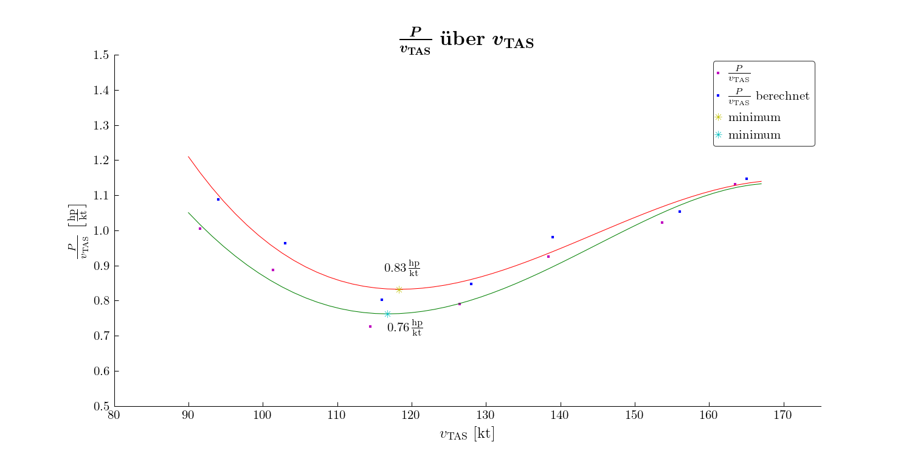

# betterstar
 Python Package that implements a better looking star for matplotlib plots.

 ## Usage Example
 
```python
from betterstar import star
import matplotlib.pyplot as plt

# some code

p33 = plt.plot(x3[i3], min3, marker=star, color='c', markersize=6, markeredgewidth=0.35)

# some more code
```
 This will result in a plot like this:
 
